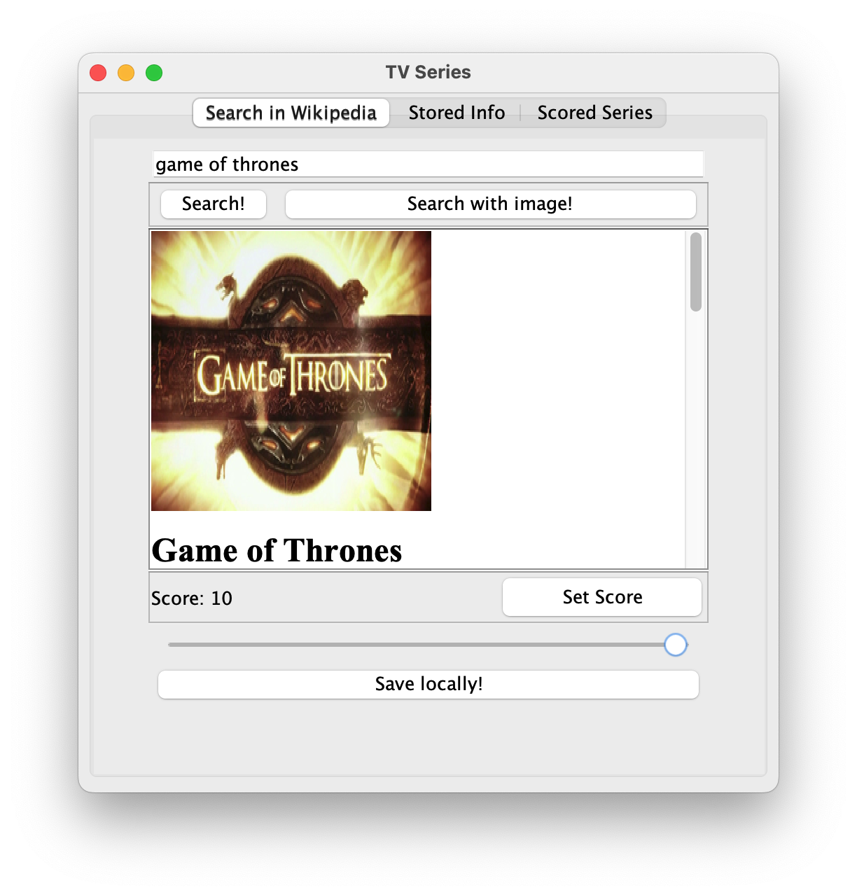

# Project Title: TV Series Management System

A modular and scalable system for managing TV series, designed with MVP architecture and following SOLID principles. The system integrates database management, JSON parsing, and a user-friendly interface for searching, storing, and scoring TV series.



---

## Table of Contents
1. [Introduction](#introduction)
2. [Features](#features)
3. [Installation](#installation)

---

## Introduction

This project re-architects a TV series management system from MVC to MVP, enhancing modularity and scalability. It includes features like database interaction, HTML formatting with images and hyperlinks, and user input validation.

---

## Features

- Modular MVP architecture.
- Integration with external APIs for TV series data (e.g., Wikipedia API).
- Dynamic image loading and hyperlinking.
- Database management for storing and scoring TV series.
- Unit and integration tests to ensure reliability.

---

## Installation

1. Clone the repository:
   ```bash
   git clone https://github.com/candela-ledesma/DyDS.git
